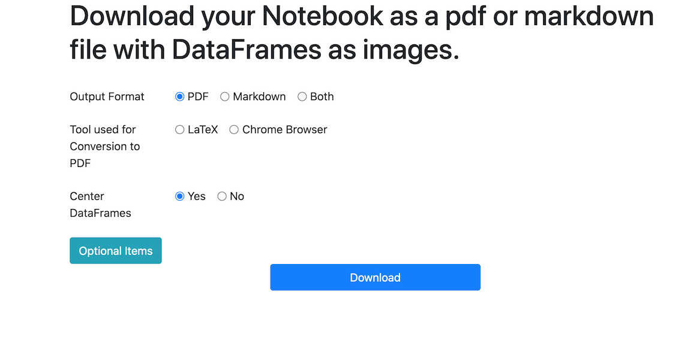

# dataframe_image

[](https://pypi.org/project/dataframe_image)
[](LICENSE)

A package to convert Jupyter Notebooks to PDF and/or Markdown documents with the following extra functionality not provided directly by nbconvert:

* Embedding pandas DataFrames into the final PDF or Markdown as they appear in the notebook
* Downloading the notebook as a PDF appearing exactly as it does in a Chrome browser (using the print as PDF feature)
* Extracting all images in markdown (inline, reference, attachments, and `` tags)
* Allowing the new document to be saved anywhere in your filesystem and correctly linking the resources

## Motivation

When converting Jupyter Notebooks to pdf using nbconvert, pandas DataFrames appear as either raw text or as a simple latex table as seen on the left side of the image below.


This package was first created to embed DataFrames into pdf and markdown documents as images so that they appear exactly as they do in a Jupyter Notebook, as seen on the right side of the image above. It has since added much more functionality.

## Installation

`pip install dataframe_image`

## Usage

There are three different ways to use dataframe_image:

* Within a Jupyter Notebook
* As a Python library
* From the command line

### Within a Jupyter Notebook

Upon installation, the option `DataFrame as Image (PDF or MD)` will appear in the menu `File -> Download as`. Clicking this option will open up a new browser tab with a short form that needs to be completed.



If converting to PDF, you must choose to convert via LaTeX or Chrome Browser. Conversion via LaTeX requires you to have LaTeX installed on your machine. Instructions for doing so can be found at the bottom of this page. When converting via LaTeX, the Chrome browser is still used to take screenshots of each DataFrame in your notebook and is a somewhat time consuming processs.

Conversion via Chrome browser is much quicker and is nearly the same as choosing File (from the browser application menu and NOT the notebook) and selecting print as PDF.

The two PDF files will look quite different, with the LaTeX version looking like a book and the browser version looking nearly identical to how it appears on your screen.

### As a Python Library

In a separate Python script, import the `dataframe_image` package and pass the file name of your notebook to the `convert` function. By default, a PDF using LaTeX will be produced. Set the `use` parameter to 'browser' to get the other version.

```python
>>> import dataframe_image as dfi
>>> dfi.convert('path/to/your_notebook.ipynb',
                to='pdf',
                use='latex',
                latex_command=None,
                max_rows=30,
                max_cols=10,
                ss_width=1000,
                ss_height=900,
                chrome_path=None,
                limit=None,
                document_name=None,
                execute=True,
                save_notebook=False,
                output_dir=None
                )
```

By default, the new file(s) will be saved in the same directory where the notebook resides. The notebook will also be executed (by default) before being exported, so do not run this command within the same notebook that is being converted, or else you will get stuck in an infinite loop.

### From the Command Line

The command line tool `dataframe_image` will be available upon installation with the same options as the `convert` function from above.

```bash
dataframe_image --to=pdf "my notebook with dataframes.ipynb"
```

## Finding Google Chrome

You must have Google Chrome (or Brave) installed in order for dataframe_image to work. The path to Chrome should automatically be found. If Chrome is not in a standard location, set it with the `chrome_path` parameter.

### Using matplotlib instead of Chrome

If do not have Chrome installed or cannot get it to work properly, you can alternatively use matplotlib to convert the DataFrames to images. Select this option by setting the `table_conversion` parameter to `'matplotlib'`.

## Publish to Medium

You can publish your notebooks as Medium blog posts by installing the [`jupyter_to_medium`](https://github.com/dexplot/jupyter_to_medium) package.

## Just Export DataFrames

You can export DataFrames directly as images from the DataFrame object itself. Import both pandas and dataframe_image and you will now have access to the `dfi` special accessor. Use the `export` method to save the DataFrame as an image in a specific location.

```python
>>> import pandas as pd
>>> import dataframe_image
>>> df = pd.read_csv('some_data.csv')
>>> df.dfi.export('mydf.png')
```

## Extras

This package also embeds any images added to markdown cells as **attachments** (done by dragging and dropping the image) as well as those referenced by HTML `` tags. It is also able to properly save the pdf/markdown and its images in a directory outside of where it is located.

## Dependencies

You must have the following python libraries installed:

* [pandas](https://github.com/pandas-dev/pandas)
* [nbconvert](https://github.com/jupyter/nbconvert) which requires latex, xelatex, and pandoc
* [matplotlib](http://matplotlib.org/)
* [BeautifulSoup](https://www.crummy.com/software/BeautifulSoup/bs4/doc/)
* [aiohttp](https://docs.aiohttp.org/en/stable/index.html)

## Installing LaTeX

It is possible to use dataframe_image without a latex installation as long as you only download pdfs via browser. Consult [nbconvert's documentation](https://nbconvert.readthedocs.io/en/latest/install.html#installing-tex) to learn how to get latex installed correctly on your machine.
